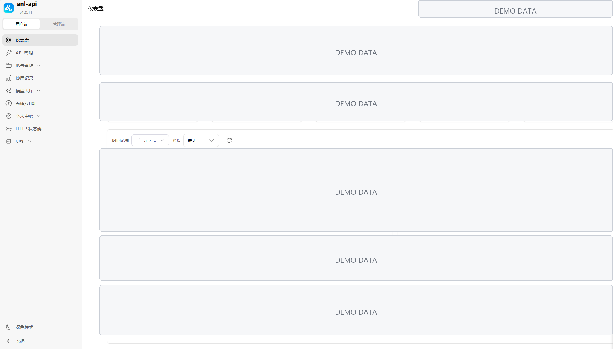
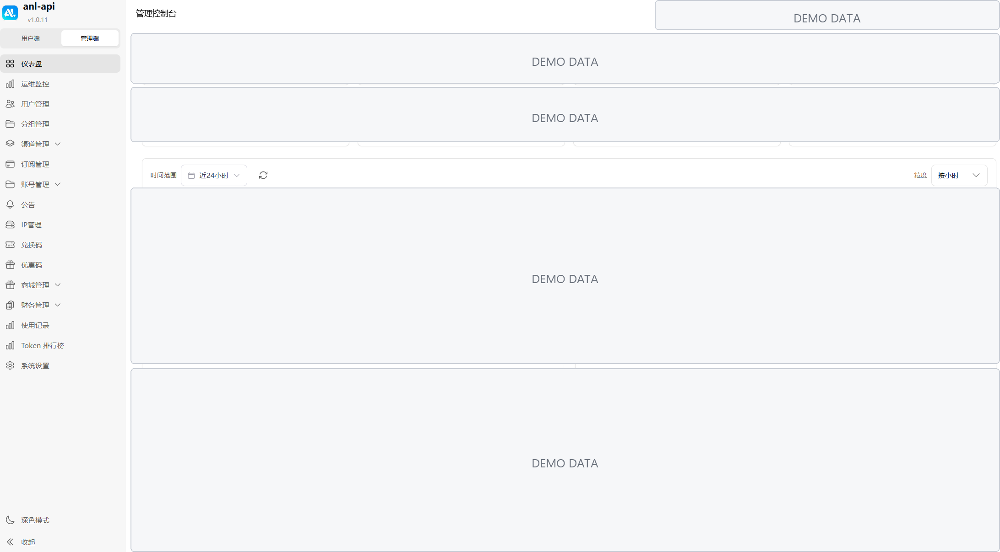

# anlapi


anlapi 是基于 Sub2API 二次开发的自托管 AI API 网关与订阅管理平台，提供账号池、API Key 管理、多供应商请求转发、用量计费、订阅充值、风控审查和后台运营能力。当前 `1.0.11` 发布快照已选择性对齐 Sub2API `v0.1.173` 的兼容与安全修复，同时保留 ANL 自己的支付、生图、账号隔离、审计和用户级并发策略。

[English](README.md) | 中文 | [日本語](README_JA.md)

站点：[https://api.anlmc.top](https://api.anlmc.top)

QQ 群：`146499741`

本仓库用于私有部署、定制和二次开发，不包含生产密钥、私有服务器配置、托管服务凭据或商业运营数据。

## 重要说明

部署或运营本项目前，请仔细阅读以下内容：

- 服务条款风险：通过订阅账号或账号型上游转发请求，可能违反部分上游供应商的服务条款。使用前请自行核对相关协议。
- 合规要求：请仅在符合所在国家或地区法律法规的前提下使用本项目。
- 账号风险：账号封禁、额度重置、服务中断、上游策略调整和计费异常都属于部署者需要自行承担和处理的运营风险。
- 免责声明：本项目仅用于技术学习、自托管和二次开发。你的部署、数据、用户、支付和上游账号均由你自行负责。

## 功能特性

- 提供 OpenAI 兼容网关接口，支持 chat、responses、models、embeddings、image 和流式请求等场景。
- 支持 Grok OAuth、Kiro OAuth、免费模型供应商接入和可配置的私有账号接入流程。
- 支持 OpenAI 兼容渠道和账号型上游的多供应商路由。
- 支持 DeepSeek 官方 API Key 快捷配置，以及 `deepseek-v4-flash`、`deepseek-v4-pro` 模型路由、思考强度和缓存命中用量计量。
- 账号池管理，包含公共、私有、自有和拼车等调度概念。
- API Key 管理，支持多分组路由、IP 访问控制、额度控制、使用记录和计费元数据。
- 用户订阅、充值流程、兑换码、邀请奖励和商城/卡密流程。
- 管理后台覆盖用户、账号、渠道、支付、风控、风险事件、数据管理和系统设置。
- 内容审查与风控接入点，支持请求/响应审计。
- 内置发布流程，支持标签构建、Docker 镜像、归档包和 GitHub Releases。
- 前端控制台基于 Vue 3、TypeScript、Pinia、Vue Router、Tailwind CSS 和 Vite。
- 后端服务基于 Go、Gin、Ent、PostgreSQL、Redis 和模块化服务边界。

### DeepSeek V4 支持

在管理后台新建 API Key 账号时，可以直接选择 **DeepSeek** 快捷入口。该入口会预填官方 API 地址 `https://api.deepseek.com`，并提供以下默认模型候选：

- `deepseek-v4-flash`
- `deepseek-v4-pro`

客户端仍然使用标准 OpenAI 兼容接口。对于 `POST /v1/chat/completions` 请求，anlapi 会根据最终模型能力选择上游协议：V4 Flash 转发到官方 Responses 路径，V4 Pro 转发到官方 Chat Completions 路径。客户端不需要感知内部端点差异，也不需要接触 DeepSeek 上游 API Key。

思考强度支持标准的 `reasoning_effort` 字段，也兼容当前支持的嵌套 provider options 形式。客户端显式传入的强度会保留，并受到管理员为分组或 API Key 配置的策略限制。

DeepSeek 返回的 `prompt_cache_hit_tokens` 等缓存 usage 会被解析进统一用量记录，并按缓存读取单价参与计费。因此这里的优化是缓存命中用量识别和计费优化，不是把完整回答缓存后直接复用。

## 快速开始

完成部署后，可以按以下顺序开始使用：

1. 在管理后台进入账号管理并新建上游账号。使用官方 DeepSeek API 时选择 **DeepSeek** 快捷入口，填入上游 API Key；除非你明确使用其他兼容服务，否则保留预填的官方地址。
2. 创建或选择一个分组，配置对外提供的模型名、模型映射以及该分组可使用的账号。
3. 创建用户 API Key，并授予它访问对应分组的权限。客户端只需要这个用户 API Key；上游凭据保留在 anlapi 服务端账号配置中。
4. 使用 OpenAI 兼容接口调用模型：

```bash
curl https://your-domain.example/v1/chat/completions \
  -H "Authorization: Bearer $ANL_API_KEY" \
  -H "Content-Type: application/json" \
  -d '{
    "model": "deepseek-v4-pro",
    "messages": [{"role": "user", "content": "你好"}],
    "reasoning_effort": "high",
    "stream": false
  }'
```

实际可用模型、路由权限、计费倍率和上游可用性以部署者的后台配置及实际上游账号状态为准。

## ANL 定制界面

这些界面截图使用演示数据，用于说明 ANL API 在用户端和管理端的定制方向。截图已做脱敏处理，余额、请求量、Token、价格、模型统计、账号和图表数据均不代表生产环境，不包含真实凭据或用户数据。

### 用户端：账户与用量仪表盘

用户可以在一个页面查看账户状态、请求用量、Token 使用趋势、模型分布和平台消费概况，适合个人或团队快速了解调用情况。

<p align="center">
  
</p>

### 管理端：运营与用量仪表盘

管理员可以集中查看 API Key、账号、用户、Token、模型分布和请求趋势等运营指标，便于进行渠道、用量和系统运行管理。

<p align="center">
  
</p>

### OpenAI Realtime / Live 使用示例

为 OpenAI 分组启用 Live 后，可通过 OpenAI 风格别名创建 WebRTC 会话。该别名复用现有 Live 请求格式：

```bash
curl -i https://your-domain.example/v1/realtime/sessions \
  -H "Authorization: Bearer $ANL_API_KEY" \
  -F 'sdp=<offer.sdp' \
  -F 'session={"model":"gpt-live"}'
```

响应体为 SDP answer，`Location` 响应头包含 `call_id`。使用同一 API Key 连接控制 WebSocket：

```bash
wscat -c 'wss://your-domain.example/v1/realtime?call_id=call_123' \
  -H "Authorization: Bearer $ANL_API_KEY"
```

原有 `POST /v1/live` 与 `GET /v1/live/:call_id` 路径继续可用。

## 1.0.11 更新内容

- 将此前生产运行的 ANL 定制、上游兼容修复、数据库迁移和管理端能力固化为可复现的 Git 发布快照。
- 新建 API Key 账号时，模型探测会复用当前表单的 Base URL 和 API Key；Key 仅在弹窗内存中使用，关闭即清空。
- 继续选择性对齐 Sub2API `v0.1.173`，补齐 OAuth 安全、上游路径、Codex 身份与容量降载恢复，同时保留 ANL 的账号隔离、支付、灾备、审计和用户级并发策略。

## 1.0.9 更新内容

- 对齐 Sub2API v0.1.165：新增 OpenAI Live 网关和分组级启用开关，并补齐数据库迁移、API、管理端配置与用量类型。
- 用量记录可保存客户端显式会话标识；OpenAI Responses 会清理残留命名空间和不合法的回放项 ID。
- Ollama Cloud 自动刷新按租户和 API Key 隔离，补齐防饥饿调度、PostgreSQL 16 时间解析兼容与失败退避。
- 注册邮箱别名查重增加数据库约束与并发保护；公告预览、移动端复制控件、Claude 5 模型和前端依赖安全修复同步更新。
- 保留 ANL 的账号导入、支付、网关、OAuth 隔离、国内灾备、审计和用户级并发策略。

## 1.0.8 更新内容

- 对齐 Sub2API v0.1.164 的兼容修复：Codex 批量导入索引、GPT-5.6 具体测试模型、OAuth `input` 规范化和渠道模型名归一化。
- OpenAI 流式响应异常断开后按共享代理隔离后续调度，正常结束和客户端主动取消不会误隔离。
- Grok 账号收到 402 后进入冷却；简易模式自动创建的 Grok 默认分组补齐生图能力，保留管理员显式关闭的分组设置。
- CC Switch 的 Grok Key 导入到 Grok Build；模型限流时间补全日期，并加强浏览器会话字段的审计脱敏。
- 保留 ANL 的支付、余额、生图专线、OAuth/API Key 隔离和用户级并发策略。本次不直接引入上游的聚合分组、Ollama Cloud 用量和支付宝移动端深链模块。

## 1.0.7 更新内容

- 对齐 Sub2API v0.1.163：新增分组级 OpenAI/Codex 推理力度上限与精确映射，并在 HTTP、WebSocket 转发链路统一执行。
- 补齐 Grok `/responses/compact`、Codex 客户端工具往返、模型级 403 隔离与缓存会话修复。
- 修复优雅关停时缓冲用量丢失、图像 Token 计费、故障切换计费、调度缓存与配额元数据问题。
- 新增 Redis ACL 用户名配置，并同步移动端布局、套餐有效期、用量筛选和倍率显示修复。
- 保留 ANL 的支付、余额、生图专线、OAuth/API Key 隔离和用户级并发策略。

## 1.0.6 更新内容

- 补齐 Sub2API v0.1.162 的上游计费探测设置与批量探测路由，修复管理端账号页加载设置时返回 404 的问题。

## 1.0.5 更新内容

- 管理端并发卡明确改为“用户实时并发”，只呈现当前真实占用与用户并发上限，不再使用“排队”标题造成误解。
- 修复窄屏顶部操作区横向溢出，同时保留右上角余额；极窄屏仅收起订阅进度小控件。

## 1.0.4 更新内容

- 对齐 Sub2API v0.1.162 的 OpenAI/Codex、Responses、Anthropic、Grok 媒体、订阅到期和异步生图存储相关改进。
- API Key IP 访问控制改为默认不信任原始转发头；只有显式配置可信代理和兼容开关后才会读取转发客户端 IP，直连源站时不能伪造 Cloudflare 头绕过限制。
- 请求并发只按用户账户执行。账号、分组、平台和 API Key 不再作为额外并发闸门；管理端仅展示用户当前真实并发与该用户上限。
- 管理端移除账号容量、分组容量、账号并发编辑和账号队列展示，避免把调度信息误当作用户限流。

## 1.0.3 更新内容

- 后端工具链升级到 Go 1.26.5，并更新存储集成相关的 AWS SDK 安全依赖。
- 新增 Grok OAuth、Kiro OAuth、K12 账号等级支持，并补充视频相关网关端点覆盖。
- 新增免费模型供应商接入、多分组 API Key 路由和 API Key IP 访问控制支持。
- 优化拼车池、私有账号、订阅、计费、推理 Token 和用量统计相关流程。
- 更新 CI、安全扫描和前端审计处理，匹配当前依赖版本。

## 技术栈

- 后端：Go 1.26.5、Gin、Ent、PostgreSQL、Redis
- 前端：Vue 3、TypeScript、Vite、Pinia、Tailwind CSS
- 测试：Go test、Vitest、vue-tsc、ESLint
- 部署：Docker 或源码构建，推荐外置 PostgreSQL 和 Redis

## 仓库结构

```text
.
├── backend/              # Go 后端、迁移、服务、处理器、仓储层
├── frontend/             # Vue 3 管理端/用户端控制台
├── deploy/               # 部署示例和配置模板
├── docs/                 # 额外集成和运维文档
├── assets/               # 项目静态资源
├── Makefile              # 常用构建和测试入口
└── Dockerfile            # 生产镜像构建
```

## 环境要求

- Go 1.26.5
- Node.js 20+
- pnpm 9+
- PostgreSQL
- Redis
- Docker，可选但推荐用于部署

## 配置

从示例配置开始：

```bash
cp deploy/config.example.yaml deploy/config.yaml
```

根据你的环境修改生成的配置：

- `server`：监听地址、端口、前端地址、请求体限制、CORS 和安全响应头。
- `database`：PostgreSQL 连接设置。
- `redis`：缓存和队列后端设置。
- `gateway`：上游超时、请求体大小限制、路由和模型行为。
- `security`：URL 白名单、响应头过滤、代理兜底和 CSP。
- 按需配置 payment、email、storage、moderation 和 OAuth 等部分。

不要提交真实生产凭据。本地和部署专用配置文件已被 git 忽略。

## 开发

安装前端依赖：

```bash
pnpm --dir frontend install
```

启动前端开发服务器：

```bash
pnpm --dir frontend run dev
```

从源码运行后端：

```bash
cd backend
go run ./cmd/server
```

首次运行时，如果没有有效配置或安装状态，后端可能会进入初始化设置流程。

## 构建

构建后端和前端：

```bash
make build
```

仅构建后端：

```bash
make build-backend
```

仅构建前端：

```bash
make build-frontend
```

构建 Docker 镜像：

```bash
docker build -t anlapi:local .
```

## 测试

运行全部已配置检查：

```bash
make test
```

运行后端测试：

```bash
cd backend
go test -tags=unit ./...
go test -tags=integration ./...
```

运行前端检查：

```bash
pnpm --dir frontend run lint:check
pnpm --dir frontend run typecheck
pnpm --dir frontend run i18n:audit:strict
pnpm --dir frontend exec vitest run
```

使用仓库配置运行 golangci-lint：

```bash
cd backend
golangci-lint run ./... --timeout=30m
```

如果本地没有安装 `golangci-lint`，可以使用和 CI 相同的版本：

```bash
cd backend
go run github.com/golangci/golangci-lint/v2/cmd/golangci-lint@v2.9.0 run ./... --timeout=30m
```

## 部署说明

生产环境建议将 anlapi 运行在 Nginx、Caddy 或托管负载均衡器等反向代理之后。

### Nginx 反向代理说明

如果使用 Nginx，并且启用了账号调度、粘性会话、Codex CLI，或客户端会发送带下划线的请求头，请在 Nginx 的 `http` 块中启用：

```nginx
underscores_in_headers on;
```

Nginx 默认会丢弃带下划线的请求头，这可能破坏会话路由和部分原生客户端兼容路径。

推荐的生产基础设置：

- 使用应用容器外部的 PostgreSQL 和 Redis。
- 挂载生产配置文件，不要把密钥写入镜像。
- 在反向代理或负载均衡器处终止 TLS。
- 不要让 `/api/*`、`/v1/*`、流式接口和网关路由进入 CDN 缓存。
- 统一配置反向代理和后端的请求体大小限制。
- 在执行迁移或升级应用前备份 PostgreSQL。

## 安全

- 不要提交 API Key、OAuth Secret、支付密钥、数据库密码或服务器凭据。
- 在公开服务前仔细检查 `deploy/config.example.yaml`。
- 使用强密码、可用时启用 MFA，并通过可信反向代理规则限制后台访问。
- 支付、存储、风控和邮件凭据应只授予最低必要权限。
- 发布变更前运行 `make secret-scan`。

## 许可证

本项目遵循 [LICENSE](LICENSE) 中包含的许可证。

## 致谢

anlapi 基于 Sub2API 构建，并在其基础上扩展了自托管 AI 网关、订阅、计费和运营流程。

- [PIXEL-API/PixelAPI](https://github.com/PIXEL-API/PixelAPI)
- [Wei-Shaw/sub2api](https://github.com/Wei-Shaw/sub2api)
